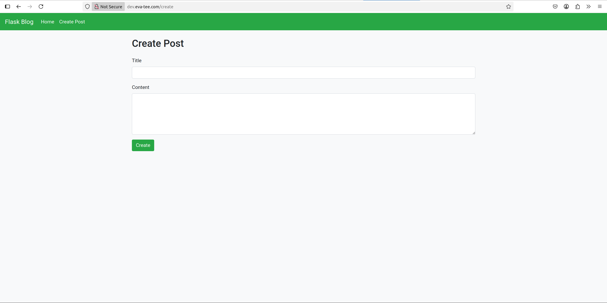
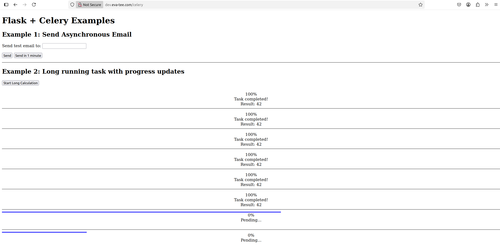
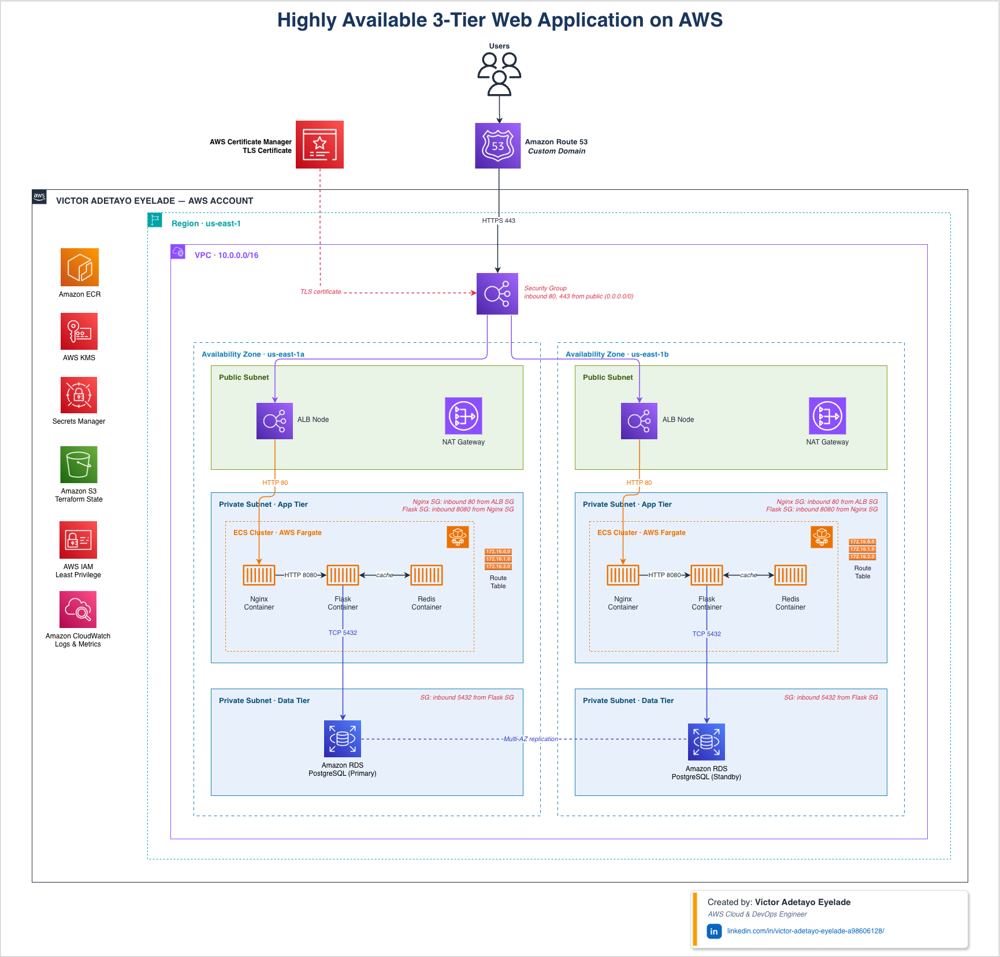
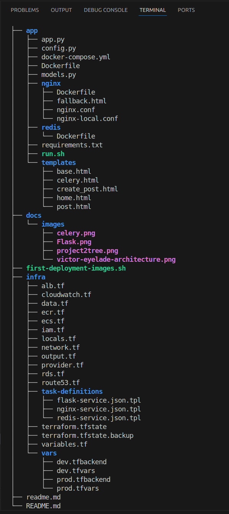

# 🚀 Production-Grade AWS ECS Fargate Platform with Terraform & GitHub Actions CI/CD

<p align="center">


</p>

A **production-ready cloud-native application platform** built on **AWS ECS Fargate**, fully provisioned using **Terraform** and deployed through an automated **GitHub Actions CI/CD pipeline**.

The platform demonstrates how modern applications are deployed in production using Infrastructure as Code (IaC), container orchestration, secure networking, automated deployments, centralized logging, secrets management, and scalable cloud infrastructure.

The application consists of:

- Flask web application
- Nginx reverse proxy
- Celery background worker
- Redis message broker
- PostgreSQL (Amazon RDS for Development)
- Amazon Aurora PostgreSQL (Production)

Infrastructure is provisioned separately for **Development** and **Production** environments with environment-aware deployments, encrypted secrets, Service Connect service discovery, Application Auto Scaling, and zero-downtime rolling deployments.

---

## 📚 Table of Contents
- [Project Screenshot](#-project-screenshot)
- [Project Overview](#-project-overview)
- [Why This Project?](#-why-this-project)
- [Key Features](#-key-features)
- [Architecture](#-architecture)
- [Project Metrics](#-project-metrics)
- [Tech Stack](#-tech-stack)
- [Infrastructure Highlights](#-infrastructure-highlights)
- [Infrastructure Design Decisions](#-infrastructure-design-decisions)
- [Engineering Challenges & Lessons Learned](#-engineering-challenges--lessons-learned)
- [CI/CD Pipeline](#-cicd-pipeline)
- [Deployment Workflow](#-deployment-workflow)
- [Running Locally](#-running-locally)
- [Deploying to AWS](#-deploying-to-aws)
- [Skills Demonstrated](#-skills-demonstrated)
- [Production Roadmap](#-production-roadmap)
- [Repository Structure](#-repository-structure)
- [Author](#-author)

---

# 📸 Project Screenshot

The screenshots below confirm the end-to-end deployment: DNS resolving correctly, TLS certificate active, the ALB routing traffic to ECS, and the application successfully connecting to RDS.

**Live Application — https://dev.eva-tee.com/create**



**Live Application — https://dev.eva-tee.com/celery**




---

# 📖 Project Overview

This project was designed to simulate the deployment architecture commonly found in enterprise cloud environments.

Instead of focusing solely on application development, it emphasizes:

- Infrastructure as Code using Terraform
- Secure AWS networking
- Container orchestration with ECS Fargate
- Automated CI/CD pipelines
- Environment separation
- High availability
- Operational excellence
- Production-ready deployment practices

The goal is to demonstrate the complete lifecycle of provisioning, deploying, operating, and maintaining a cloud-native application using AWS best practices.

---

# 🎯 Why This Project?

This project was built to demonstrate the complete lifecycle of deploying and operating modern cloud-native applications on AWS.

Rather than focusing solely on application development, it showcases the engineering practices required to build reliable production systems, including infrastructure automation, secure networking, CI/CD, observability, secrets management, scalability, and operational resilience.

The platform reflects many of the technologies and design patterns used in enterprise DevOps and Cloud Engineering teams, emphasizing not only *how* to deploy applications, but also *how to operate them securely, reliably, and at scale*.

---

# ⭐ Key Features

- Terraform-provisioned AWS infrastructure
- Multi-environment deployments (dev/prod)
- ECS Fargate container platform
- GitHub Actions CI/CD
- Zero-downtime rolling deployments
- AWS Secrets Manager and KMS integration
- Multi-AZ networking
- CloudWatch centralized logging

---

# 🏗 Architecture



### Architecture Highlights

- Three-tier VPC architecture
- Public subnets for ALB and NAT Gateway
- Private ECS subnets
- Isolated database subnets
- Multi-AZ deployment
- Internal service communication via ECS Service Connect
- Private database access only
- HTTPS secured with ACM certificates
- DNS managed through Route53

---

# 📊 Project Metrics

| Metric | Value |
|---------|-------|
| Containers | 3 (Flask, Nginx, Redis) |
| AWS Services Used | 15+ (ECS Fargate, ECR, ALB, RDS/Aurora, VPC, IAM, CloudWatch, Secrets Manager, KMS, Route53, ACM, NAT Gateway, EIP, Cloud Map, Security Groups)|
| Terraform Resources | 40 unique resource blocks|
| GitHub Actions Workflows | 3 (build-deploy.yaml, deploy-remote-hook.yaml, terraform.yaml)  |
| Deployment Environments | 2 (dev, prod)|
| Availability Zones | 2 |
| Container Images | Flask, Nginx, Redis |
| Infrastructure Provisioning | 100% Terraform |
| Deployment Strategy | Rolling Updates |
| RDS Engine | PostgreSQL 14.22 (RDS + Aurora cluster)|
| Task CPU / Memory (per service)| 1024 CPU / 2048 MiB |

---

# 💻 Tech Stack

| Layer | Technology |
|--------|------------|
| Application | Python, Flask, Flask-SQLAlchemy |
| Background Jobs | Celery |
| Reverse Proxy | Nginx |
| Cache / Message Broker | Redis |
| Database | PostgreSQL, Amazon Aurora PostgreSQL |
| Containers | Docker |
| Container Orchestration | AWS ECS Fargate |
| Infrastructure as Code | Terraform |
| CI/CD | GitHub Actions |
| Cloud Platform | AWS |
| Networking | VPC, ALB, Route53, ACM |
| Monitoring | CloudWatch Logs, CloudWatch Insights |
| Secrets Management | AWS Secrets Manager |
| Encryption | AWS KMS |

---

# ☁️ Infrastructure Highlights

All AWS infrastructure is provisioned using **Terraform**, following Infrastructure as Code (IaC) best practices.

## Networking

- Three-tier VPC architecture spanning two Availability Zones
- Public subnets for the Application Load Balancer and NAT Gateway
- Private subnets for ECS services and databases
- Route 53 DNS with ACM-managed HTTPS certificates

## Compute

- Multi-container application deployed on Amazon ECS Fargate
- ECS Service Connect for private service discovery
- Zero-downtime rolling deployments with Application Auto Scaling

## Database

- **Development:** Amazon RDS PostgreSQL
- **Production:** Amazon Aurora PostgreSQL (writer and reader instances)
- Environment-aware provisioning from a single Terraform codebase

## Security

- Least-privilege IAM roles and Security Groups
- AWS Secrets Manager for application secrets
- AWS KMS encryption for sensitive resources
- Private networking with no direct database exposure

## Observability

- Centralized application logging with Amazon CloudWatch
- CloudWatch Insights for log analysis
- Deployment monitoring and operational visibility

---

# ⚙️ Infrastructure Design Decisions

Several Terraform patterns were implemented to keep the infrastructure scalable and maintainable.

### Dynamic ECS Services

Instead of creating separate Terraform resources for each service, a single `for_each` pattern dynamically provisions:

- Flask
- Nginx
- Redis

This eliminates duplicated code and makes adding additional services straightforward.

---

### Environment-Aware Infrastructure

Terraform automatically provisions different resources depending on the target environment.

Development:

- Single Amazon RDS PostgreSQL instance

Production:

- Aurora PostgreSQL Cluster
- Writer instance
- Reader instance

The same Terraform codebase manages both environments without duplication.

---

### Service Discovery

Internal communication is handled through **ECS Service Connect**, allowing containers to communicate using stable DNS names instead of hardcoded IP addresses.

Examples:

```
http://app

http://redis

http://nginx
```

This simplifies service discovery while improving reliability.

---

### Secrets Management

Application secrets are never hardcoded.

Terraform automatically stores:

- Database credentials
- Deployment metadata
- Container configuration

inside **AWS Secrets Manager**, encrypted with a dedicated AWS KMS key.

GitHub Actions retrieves these secrets securely during deployment.

---


# 🧩 Engineering Challenges & Lessons Learned

Building production infrastructure is as much about solving operational problems as it is about writing Terraform. Throughout this project, I encountered and resolved several real-world infrastructure and deployment challenges that improved the platform's reliability and resilience.

## Key Challenges Solved

### GitHub Actions Workflow Discovery

Initially, GitHub Actions failed to detect the Terraform workflow because it was placed outside the `.github/workflows` directory. Correcting the workflow location restored automatic workflow discovery.

---

### Terraform Remote State Authentication

Terraform could not initialize the remote S3 backend because AWS credentials were configured after the initialization step.

Reordering the workflow to authenticate with AWS before running `terraform init` resolved the issue and ensured reliable remote state management.

---

### ECS Logging Configuration

ECS tasks failed during startup because the referenced CloudWatch Log Groups had not yet been provisioned.

CloudWatch Log Groups are now automatically created through Terraform before task deployment, ensuring successful container startup and centralized logging.

---

### Environment Configuration Management

Terraform variable files required for CI deployments were unintentionally ignored by Git due to default `.gitignore` rules.

The repository was updated to explicitly track only the required environment configuration files while continuing to protect sensitive configuration.

---

### Service Startup Dependencies

During local development, the application occasionally attempted to connect to PostgreSQL and Redis before either service was ready.

Docker health checks and dependency conditions were implemented to ensure containers start only after required services report a healthy state.

---

### Graceful Failure Handling

Users were presented with default Nginx gateway errors whenever the application restarted during deployments.

Custom fallback pages were implemented to provide a cleaner user experience during rolling deployments or temporary upstream outages.

---

### Infrastructure Maintainability

Instead of duplicating Terraform resources for each ECS service, the infrastructure uses dynamic `for_each` expressions and reusable task definition templates.

This significantly reduced code duplication while making future service expansion considerably easier.

---

# 🔄 CI/CD Pipeline

Deployment is fully automated using **GitHub Actions**.

## Workflow 1 — Infrastructure Provisioning

**terraform.yaml**

Responsible for:

- Terraform Init
- Terraform Validate
- Terraform Plan
- Terraform Apply
- Terraform Destroy

Supports both Development and Production environments.

---

## Workflow 2 — Application Deployment

**build-deploy.yaml**

Deployment process:

```
Developer Push

↓

GitHub Actions

↓

Build Docker Image

↓

Push Image to Amazon ECR

↓

Retrieve Deployment Metadata

↓

Render ECS Task Definition

↓

Deploy to ECS

↓

Wait for Service Stability
```

Features:

- Image versioning using Git commit SHA
- Rolling deployments
- Zero downtime
- Automatic task definition updates
- Environment-aware deployments

---

## Workflow 3 — External Deployments

**deploy-remote-hook.yaml**

Supports deployments triggered externally using GitHub's `repository_dispatch` event.

This enables deployment requests from:

- External CI/CD systems
- Automation pipelines
- Internal deployment tools
- Release orchestration workflows

---


# 📈 Deployment Workflow

The deployment pipeline follows this lifecycle:

```
Terraform

↓

Provision AWS Infrastructure

↓

GitHub Actions

↓

Build Docker Images

↓

Amazon ECR

↓

Render ECS Task Definitions

↓

Deploy ECS Services

↓

Rolling Update

↓

Application Available
```

Deployment metadata is generated by Terraform and securely stored in **AWS Secrets Manager**.

GitHub Actions retrieves this metadata at runtime, ensuring workflows remain environment-independent and free from hardcoded infrastructure values.

---

# 🖥 Running Locally

The application can be executed locally using Docker Compose.

```bash
cd app

docker compose up --build
```

Available services:

| Service | URL |
|----------|-----|
| Nginx | http://localhost:8000 |
| Flask | http://localhost:8080 |
| PostgreSQL | localhost:5432 |
| Redis | localhost:6379 |

Docker Compose waits until PostgreSQL and Redis pass their health checks before starting the application, preventing startup race conditions.

---

# 🚀 Deploying to AWS

Initialize Terraform:

```bash
cd infra

terraform init \
-backend-config=vars/dev.tfbackend
```

Plan infrastructure:

```bash
terraform plan \
-var-file=vars/dev.tfvars
```

Deploy:

```bash
terraform apply \
-var-file=vars/dev.tfvars
```

For Production:

```bash
terraform init \
-backend-config=vars/prod.tfbackend

terraform plan \
-var-file=vars/prod.tfvars

terraform apply \
-var-file=vars/prod.tfvars
```

Destroy infrastructure:

```bash
terraform destroy \
-var-file=vars/dev.tfvars
```

For the first deployment, bootstrap Amazon ECR repositories:

```bash
./first-deployment-images.sh
```

Infrastructure provisioning can also be executed directly from GitHub Actions using the Terraform workflow.


---

# 🛠 Skills Demonstrated

This project demonstrates practical experience with modern cloud engineering and DevOps practices including:

| AWS Services | Infrastructure as Code | DevOps & Containers | Security |
|--------------|------------------------|---------------------|----------|
| Amazon ECS Fargate | Terraform | Docker | IAM |
| Amazon RDS & Aurora | Terraform Modules | GitHub Actions | AWS Secrets Manager |
| Amazon ECR | Remote State | CI/CD Pipelines | AWS KMS |
| Application Load Balancer | `for_each` & Dynamic Resources | Rolling Deployments | Security Groups |
| Route53 & ACM | Multi-Environment Infrastructure | Docker Compose | Private Networking |
| CloudWatch | Infrastructure Automation | Container Orchestration | HTTPS/TLS |

---

# 🚀 Production Roadmap

Although the platform is production-ready, several enhancements could further strengthen its capabilities.

### Planned Improvements

- Blue/Green deployments
- Canary deployments
- Amazon ElastiCache for Redis
- Amazon EFS shared storage
- Prometheus metrics collection
- Grafana dashboards
- OpenTelemetry distributed tracing
- AWS X-Ray integration
- AWS WAF for Layer 7 protection
- ECS Exec support
- Automated database migrations
- Disaster recovery automation
- Multi-region deployment strategy

---

# 📂 Repository Structure

The repository is organized to separate application code, infrastructure, automation, and deployment workflows.


---

# 👨‍💻 Author

**Victor Adetayo Eyelade (Evatee-coder)**

AWS Cloud & DevOps Engineer 

GitHub: https://github.com/Evatee-coder

LinkedIn: **www.linkedin.com/in/victor-adetayo-eyelade-a98606128**

---

## ⭐ If you found this project interesting...

If this repository helped you, inspired you, or you'd like to discuss cloud engineering, DevOps, or AWS architecture, feel free to connect or leave a ⭐ on the repository.

Contributions, suggestions, and feedback are always welcome.

---


